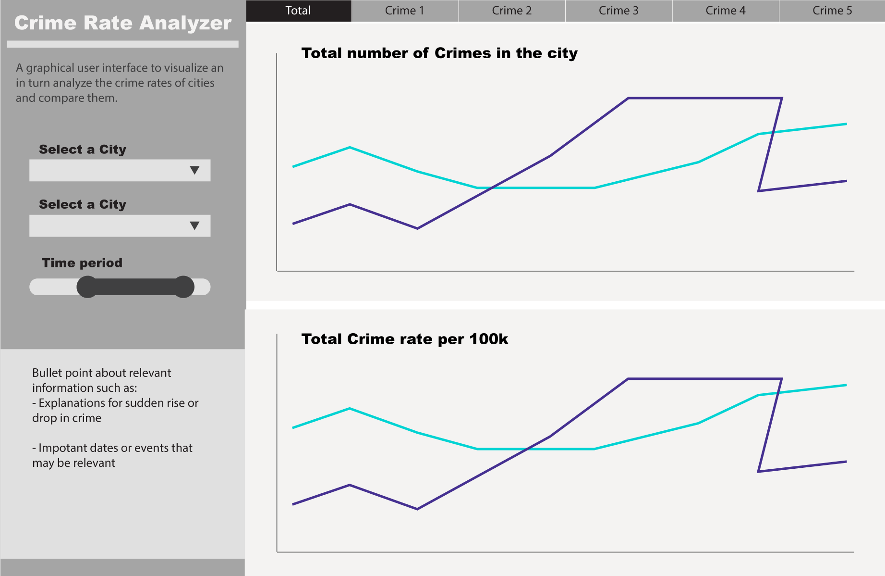

# Proposal  

##### Overview  

Deciding to move to a new city is already a stressful experience, the last thing you want is to also have to worry about you safety when you arrive. You need to be able to compare the crime rates of potential cities in order to factor that into your final decision as well. To address this issue, we are going build a data visualization app that individuals can use to gain insight into the violent crime rates of US cities. Our application will allow users to pick two cities at a time so they compare raw and normalized crime numbers. For further granularity the user will also be able to limit the time period and compare specific categories of violent crime. 

##### Data  
Our visualization will present violent crime data for 68 US cities between 1975-2015. For every city and year, we have information for both the raw and normalized numbers for each of the following categories of violent crime:  

| Category | Raw Variable | Normalized Variable |
|----------|--------------|---------------------|
| Homicide | homs_sum     | homs_per_100k       |
| Rape     | rape_sum     | rape_per_100k       |
| Robbery  | rob_sum      | rob_per_100k      |
| Aggravated Assault | agg_ass_sum     | agg_ass_per_100k      |
| Total    | violent_crime     | violent_per_100k      |  

The normalized variables show the  crime rate per 100,000 people for a particular city and violent crime category of interest.

##### Usage Scenario & Tasks

Jonathan is a college graduate student and is looking to apply for jobs in the United States of America. In an effort to narrow his search, Jonathan would like to research the crime profiles of various major cities and select the ones with the lowest crime rates. When Jonathan logs into the app, he will be able interact with the data by selecting the cities and the time period over which he wants to analyze the cities’ total crime rate. Jonathan would also be able to select the types of crime and investigate each type of crime separately . By looking at the data over a time period, Jonathan could observe which cities have become safer or riskier over time and by exploring individual crimes in his candidate cities, he can be further discover which crimes in particular he needs to safeguard against.

##### App Sketch  

The app will have a single landing page. The user will be able to interact with the app by selecting up to two cities from a drop down menu and setting a time period on a slider. Furthermore, tabs at the top of the visualization will allow them to switch between the total and individual crime rates in the cities selected. The visualizations will be line graphs with colours used to differentiate between the cities.  

